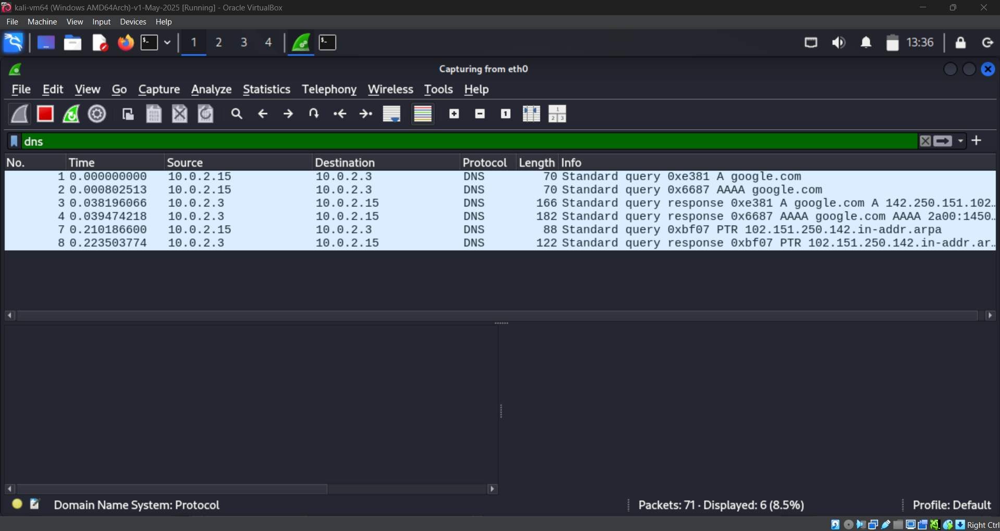
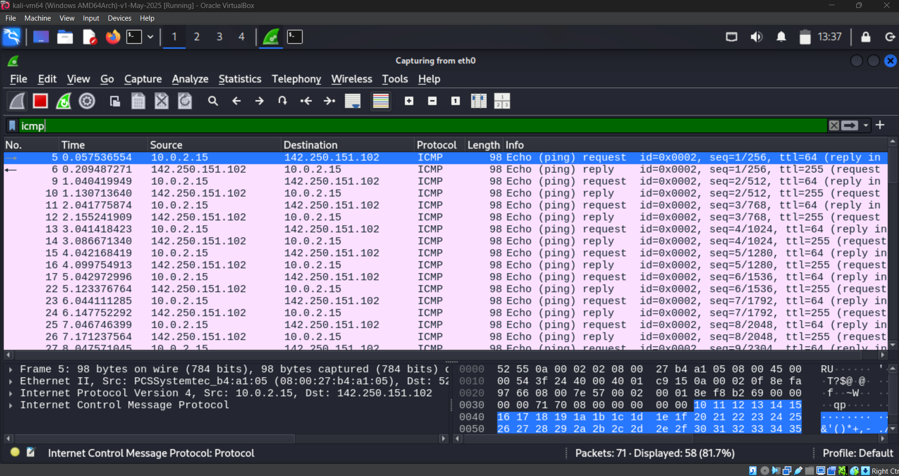

# Wireshark Traffic Analysis
**Date:** 12/03/2026
**Analyst:** Tahmid
**Tool:** Wireshark 4.4.4

## Objective
Capture and analyse live network traffic to identify 
protocols and understand normal network behaviour.

## Captures

### 1. DNS Traffic Analysis
**Filter used:** `dns`

**Findings:**
- Machine 10.0.2.15 queried DNS server 10.0.2.3 for google.com
- DNS resolved google.com to 142.250.151.102
- Both A record (IPv4) and AAAA record (IPv6) queried
- Reverse DNS lookup observed — normal behaviour

### 2. ICMP Traffic Analysis
**Filter used:** `icmp`

**Findings:**
- Successful ping to Google (142.250.151.102)
- All requests received replies — healthy connection
- TTL=64 outbound, TTL=255 inbound
- No dropped packets detected

## Key Learnings
- DNS resolution always happens before a connection
- ICMP echo request/reply confirms host is alive
- Missing replies = potential firewall or dead host

## SOC Relevance
- Unusual DNS queries = potential data exfiltration
- ICMP flood = potential DDoS attack
- Unexpected destinations = potential C2 communication

## Tools Used
- Wireshark 4.4.4
- Kali Linux
